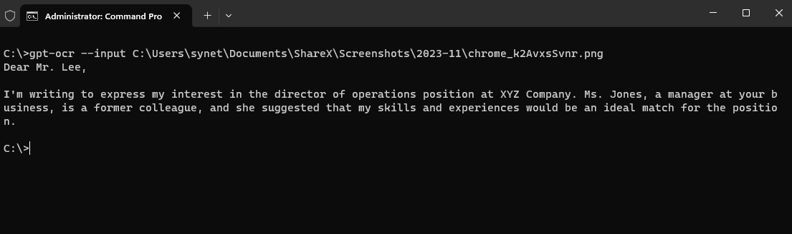

# GPT-OCR

## Introduction
GPT-OCR is an easy-to-use command line interface tool to quickly read text from any \*.jpg/png image using OpenAI's GPT4-Vision-Preview model. Available for Windows and Linux and can be used either standalone or integrated into other processes.



## Installation
### Prerequisites
* Windows or Linux Operating System
* OpenAI API Key

### How to use
Download the binary [here](https://github.com/synetic707/gpt-ocr/releases/tag/1.0) and execute it via command line. Usage:
```bash
gpt-ocr.exe --input (path to the image) --apikey (openai api key)
```
The ``--apikey`` flag can be omitted by setting the environment variable ``OCR_APIKEY``
